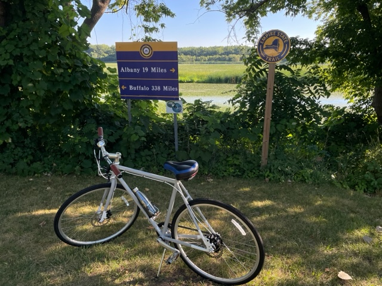
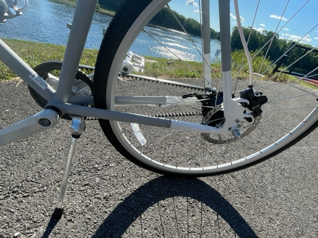

<html>
<body>
<h2> <b> Home sweet home </b> </h2>

<h2> <b> Work </b> </h2>

 <a href="https://www.albany.edu/sph/faculty/ye-ding" > Ye </a>  works on <a href="https://sfoldrna.github.io"> RNA Bioinformatics </a>

 Lei is an Auditing manage at <a href="https://www.nystrs.org"> NYSTRS </a>
 

 <a href="https://tiffanyding.github.io"> Tiffany  </a> is pursuing a Ph.D in Statistic at 
   <a href="https://statistics.berkeley.edu"> University of California, Berkeley  </a> 

 Michael is an undergraduate student at <a href="https://www.rochester.edu "> University of Rochester </a> 

<table>
  <tr>
    
    
    
    
  </tr>
</table>

<body>
    

      
  
 
      
  
 
     
  
 
    

  </body>
  
.container {
  align-items: center; 
  float: left;
}
.image{
    float: left;
  padding: 5px;
}  
<h2> <b> Hobies </b> </h2>

<h2> <b> When we were young :-) </b> </h2>

</body>
</html>
